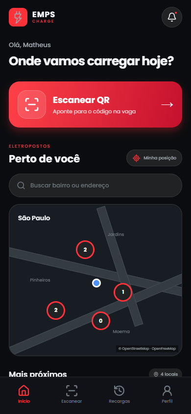
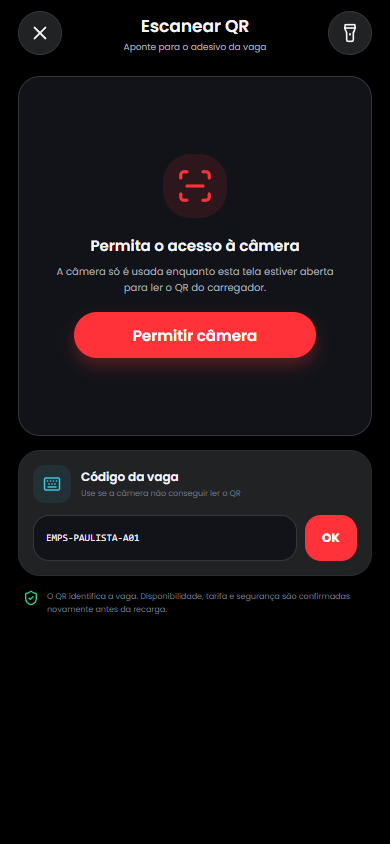
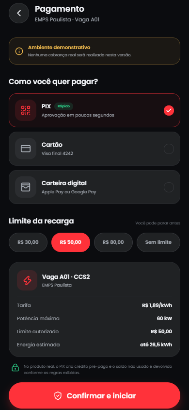
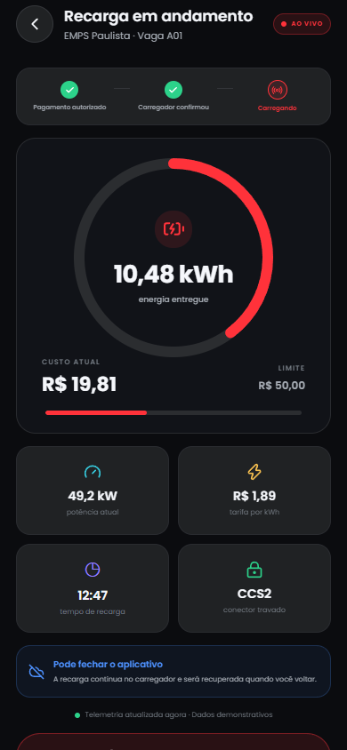
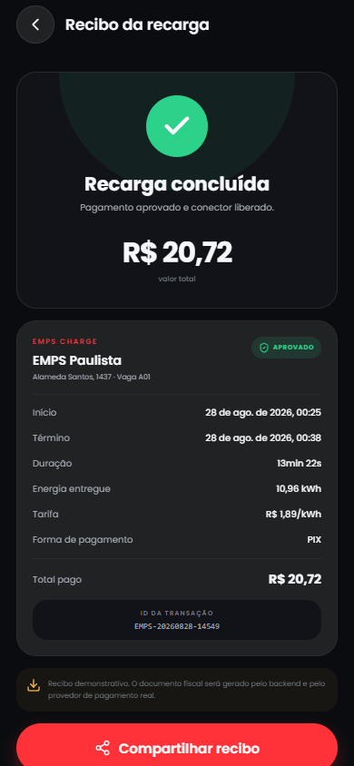

# EMPS Charge — aplicativo Android e iOS

Aplicativo do motorista para localizar eletropostos, ler o QR code da vaga, escolher a forma de pagamento, iniciar uma recarga e acompanhar consumo, tempo e custo.

O projeto usa Expo 57 + React Native e gera Android, iOS e uma versão web de conferência a partir do mesmo código. Nesta entrega, os fluxos operam com dados demonstrativos persistidos no aparelho; nenhuma cobrança real ou comando físico é enviado.

## Prévia

| Início | Leitor de QR | Pagamento |
| --- | --- | --- |
|  |  |  |

| Recarga ao vivo | Recibo |
| --- | --- |
|  |  |

## O que já funciona

- Login e cadastro com nome, e-mail e senha.
- Sessão local persistida e token demonstrativo protegido no Keychain/Keystore.
- Mapa com OpenFreeMap/OpenStreetMap, localização opcional e lista por proximidade.
- Detalhe de eletroposto, vagas, conectores, potência, tarifa, disponibilidade e rota externa.
- Leitor real de QR code pela câmera e alternativa por código digitado.
- Validação de QR EMPS, deep link HTTPS e retomada do carregador após login/cadastro.
- Pagamento demonstrativo com PIX, cartão e carteira digital.
- Limite de gasto, confirmação da vaga e início idempotente preparado no contrato de API.
- Tela de recarga ao vivo com energia, potência, custo, duração e limite.
- Encerramento confirmado, recibo compartilhável e histórico persistido.
- Perfil, métodos de pagamento e áreas preparadas para veículo, notificações, ajuda e LGPD.
- Ícones, splash, permissões, bundle IDs e perfis de build Android/iOS.

## Executar

Requisitos: Node.js e npm.

```bash
cd mobile
npm install
npm start
```

Com o servidor do Expo aberto:

- Leia o QR exibido no terminal com o Expo Go no Android ou iPhone.
- Pressione `a` para abrir um emulador Android configurado.
- Pressione `w` para abrir a versão web de conferência.
- Para compilar iOS a partir do Windows, use o serviço EAS Build ou teste primeiro pelo Expo Go.

Credenciais demonstrativas:

```text
E-mail: motorista@emps.com
Senha:  emps123
```

Código de carregador para testar sem câmera:

```text
EMPS-PAULISTA-A01
```

QR de carregador para testar a câmera (abra esta imagem em outra tela ou imprima):


> O QR exibido pelo terminal do Expo contém um endereço `exp://` e serve somente para abrir o aplicativo. Ele não é um QR de carregador EMPS.

Também são aceitos os formatos:

```text
https://app.emps.com.br/c/paulista-a01-demo
emps://charger/chg_001
```

## Verificações

```bash
npm run check
npm run export
```

O primeiro comando executa lint, checagem completa de TypeScript e os testes automatizados de QR, links seguros, distância e formatação. O segundo gera os pacotes Android, iOS e a versão web de conferência em `dist/`.

## Gerar builds instaláveis

O arquivo `eas.json` já contém perfis de desenvolvimento, APK interno e produção.

```bash
npx eas-cli login
npx eas-cli build --platform android --profile preview
npx eas-cli build --platform ios --profile preview
```

Antes de publicar, altere o identificador `com.emps.charge` caso a organização use outro domínio, associe o projeto à conta Expo/EAS e configure as credenciais das lojas.

## Mapas

O app usa MapLibre GL dentro de uma WebView nativa com o estilo público do OpenFreeMap. Não exige chave, cartão ou conta de faturamento. A posição do usuário vem de `expo-location`, solicitada somente ao tocar em “Minha posição”. A rota abre Apple Maps no iOS ou Google Maps no Android por URL, também sem chave.

OpenFreeMap não oferece SLA. Para escala comercial, é prudente contratar um provedor compatível ou hospedar os próprios tiles, preservando a atribuição do OpenStreetMap.

## Integração futura

O contrato tipado está em `src/services/mobile-api.ts` e o desenho completo em `INTEGRATION.md`. O backend atual do painel é administrativo e ainda não possui contas de consumidor, estação geográfica, QR, gateway de pagamento, telemetria nem OCPP; portanto não deve ser ligado diretamente ao app sem essa camada.

Variáveis previstas:

```bash
cp .env.example .env
```

```text
EXPO_PUBLIC_EMPS_API_URL=http://IP-DA-MAQUINA:3001
EXPO_PUBLIC_EMPS_DEMO_MODE=true
```

Em aparelho físico, `localhost` aponta para o próprio celular. Use o IP local do computador ou uma URL HTTPS acessível.
